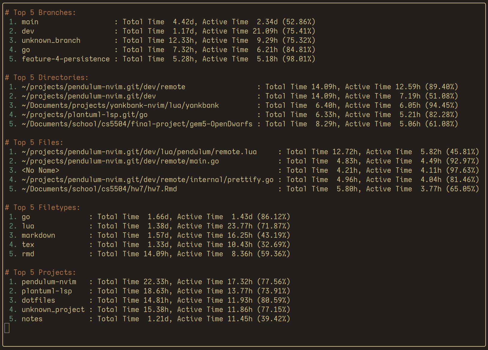

# Pendulum-nvim

Pendulum is a Neovim plugin designed for tracking time spent on projects within Neovim. It logs various events like entering and leaving buffers and idle times into a CSV file, making it easy to analyze your coding activity over time.

Pendulum also includes a user command that aggregates log information into a popup report viewable within your editor



## Motivation

Pendulum was created to offer a privacy-focused alternative to cloud-based time tracking tools, addressing concerns about data security and ownership. This "local-first" tool ensures all data stays on the user's machine, providing full control and customization without requiring internet access. It's designed for developers who prioritize privacy and autonomy but are curious about how they spend their time.

## What it Does

- Automatic Time Tracking: Logs time spent in each file along with the workding directory, file type, project name, and git branch if available.
- Activity Detection: Detects user activity based on cursor movements (on a timer) and buffer switches.
- Customizable Timeout: Configurable timeout to define user inactivity.
- Event Logging**: Tracks buffer events and idle periods, writing these to a CSV log for later analysis.
- Report Generation: Generate reports from the log file to quickly view how time was spent on various projects (requires Go installed).

## Installation

Install Pendulum using your favorite package manager:

#### With Report Generation (Requires Go)

With lazy.nvim
```lua
{
    "ptdewey/pendulum-nvim",
    config = function()
        require("pendulum").setup()
    end,
}
```

#### Without Report Generation

With lazy.nvim
```lua
{
    "ptdewey/pendulum-nvim",
    config = function()
        require("pendulum").setup({
            gen_reports = false,
        })
    end,
}
```

## Configuration

Pendulum can be customized with several options. Here is a table with configurable options:

| Option        | Description                                       | Default                        |
|---------------|---------------------------------------------------|--------------------------------|
| `log_file`    | Path to the CSV file where logs should be written | `$HOME/pendulum-log.csv`       |
| `timeout_len` | Length of time in seconds to determine inactivity | `180`                          |
| `timer_len`   | Interval in seconds at which to check activity    | `120`                          |
| `gen_reports` | Generate reports from the log file                | `true`                         |
| `top_n`       | Number of top entries to include in the report    | `5`                            |

Example configuration with custom options:

```lua
require('pendulum').setup({
    log_file = vim.fn.expand("$HOME/Documents/my_custom_log.csv"),
    timeout_len = 300,  -- 5 minutes
    timer_len = 60,     -- 1 minute
    gen_reports = true, -- Enable report generation (requires Go)
    top_n = 10,         -- Include top 10 entries in the report
})
```

## Usage

Once configured, Pendulum runs automatically in the background. It logs each specified event into the CSV file, which includes timestamps, file names, project names (from Git), and activity states.

The CSV log file will have the columns: `time`, `active`, `file`, `filetype`, `cwd`, `project`, and `branch`.

## Report Generation

Pendulum can generate detailed reports from the log file. To use this feature, you need to have Go installed on your system. The report includes the top entries based on the time spent on various projects.

To rebuild the Pendulum binary and generate reports, use the following commands:

```vim
:PendulumRebuild
:Pendulum
```

The :PendulumRebuild command recompiles the Go binary, and the :Pendulum command generates the report based on the current log file.
I recommend rebuilding the binary after the plugin is updated.


If you do not want to install Go, report generation can be disabled by changing the `gen_reports` option to `false`. Disabling reports will cause the `Pendulum` and `PendulumRebuild` commands to not be created since they are exclusively used for the reports feature.

```lua
config = function()
    require("pendulum").setup({
        -- disable report generations (avoids Go dependency)
        gen_reports = false,
    })
end,
```

## Future Ideas

These are some potential future ideas that would make for welcome contributions for anyone interested.

- Logging to SQLite database (optionally)
- Telescope integration
- Get stats for specified project, filetype, etc. (Could work well with Telescope)

